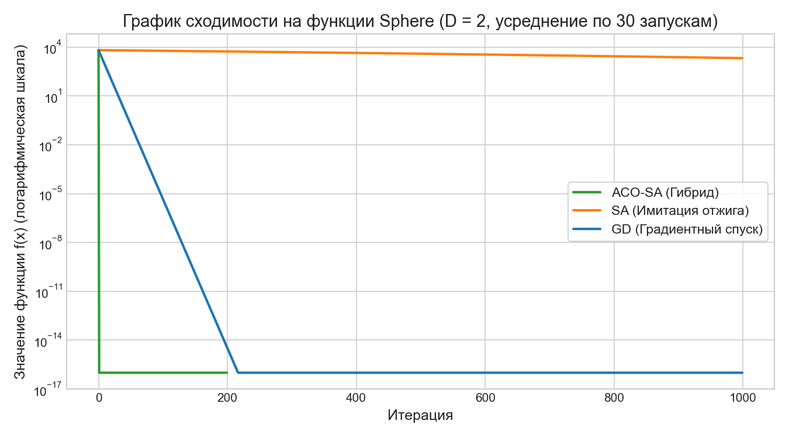
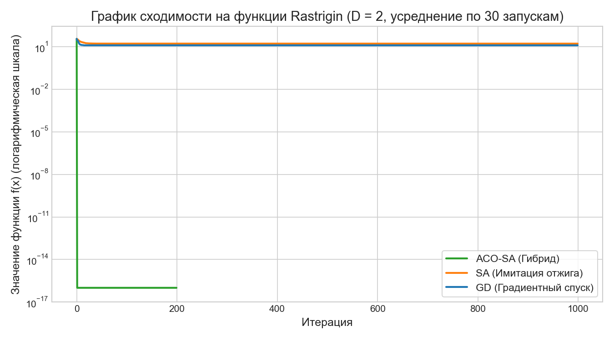

# Исходный код Выпускной Квалификационной Работы (ВКР)

В репозитории лежит код и результаты тестов для моей ВКР. 

Цель работы - разработка гибридного алгоритма глобальной оптимизации для решения обратных задач механики (поиск скрытых дефектов и полостей в конструкциях).

## Что здесь реализовано:
- **Гибридный алгоритм ACO-SA:** объединяет глобальный поиск муравьиного алгоритма (Ant Colony Optimization) на дискретной сетке феромонов и локальный поиск методом имитации отжига (Simulated Annealing) для точной подстройки координат в непрерывном пространстве.
- **Синтетическое тестирование:** набор из 22 классических бенчмарков (Sphere, Rastrigin, Rosenbrock, Ackley и др.) для проверки сходимости алгоритма в сравнении с обычным отжигом (SA) и градиентным спуском (GD).
- **Кэширование:** обертка `CachedObjectiveFunction` с настраиваемой точностью. Помогает не запускать тяжелые МКЭ-расчеты повторно в близких точках.
- **Интеграция с ACELAN:** пример поиска полости в упругом кубе по замерам перемещений на границе. Библиотека ACELAN заменена заглушками (Mocks) для переносимости, чтобы проект компилировался и проходил тесты на любом компьютере.

---

## Структура решения

Проект написан на C# .NET 10.0 и разбит на три части:

1. [**Vkr.Optimization**] (Библиотека классов)
   - `IOptimizer`, `IObjectiveFunction` - интерфейсы оптимизатора и целевой функции.
   - `AntAnnealingOptimizer` - реализация гибридного алгоритма ACO-SA.
   - `SimulatedAnnealingOptimizer` - классическая имитация отжига.
   - `GradientDescentOptimizer` - градиентный спуск (градиент считается численно).
   - `CachedObjectiveFunction` - обертка с кэшированием вычислений.

2. [**Vkr.SyntheticBenchmarks**] (Консольное приложение)
   - 22 тестовые функции в `TestFunctions.cs`.
   - Сбор статистики по 30 независимым прогонам для каждого алгоритма и выгрузка отчетов в CSV.
   - Все алгоритмы на каждом прогоне стартуют из одинаковой случайной начальной точки для честности сравнения.

3. [**Vkr.AcelanIntegration**] (Тестовый проект NUnit)
   - Тест идентификации полости `DirectHolePerturbationTest.cs`.
   - Файл заглушек `AcelanMocks.cs` для сборки решения без оригинального МКЭ-комплекса.

---

## Запуск проекта

Нужен установленный .NET SDK версии 10.0 или выше.

### 1. Запуск синтетических тестов сходимости
Для запуска тестов на 22 функциях (размерность $D = 2$):
```bash
dotnet run --project Vkr.SyntheticBenchmarks -- 2
```
CSV-отчеты сохраняются в папку `results/D2/`.

### 2. Запуск интеграционного теста ACELAN
Для запуска теста оптимизации полости на заглушках вычислителя:
```bash
dotnet test Vkr.AcelanIntegration --logger "console;verbosity=normal"
```

---

## Результаты вычислительных экспериментов

В таблице приведены результаты сравнения алгоритмов по итогам 30 независимых запусков для каждой функции при $D = 2$. На каждом запуске алгоритмы стартовали из одинаковой случайной точки.
Успехом считалось достижение глобального минимума с точностью $\varepsilon = 10^{-5}$ (для функций со сдвигом - точное попадание в глобальный экстремум).

| Тестовая функция | ACO-SA (Успех) | ACO-SA (Среднее f) | SA (Успех) | SA (Среднее f) | GD (Успех) | GD (Среднее f) |
| :--- | :---: | :---: | :---: | :---: | :---: | :---: |
| **Sphere** | 100% | `0.000E+00` | 0% | `9.540E-06` | 100% | `1.849E-44` |
| **Elliptic** | 100% | `0.000E+00` | 0% | `2.160E+03` | 0% | `3.305E+09` |
| **SumSquare** | 100% | `0.000E+00` | 0% | `7.845E-06` | 100% | `2.381E-44` |
| **sumPower** | 100% | `0.000E+00` | 7% | `7.862E-07` | 100% | `2.326E-09` |
| **Schwefel 2.22** | 100% | `0.000E+00` | 0% | `2.274E-03` | 0% | `3.216E-02` |
| **Schwefel 2.21** | 100% | `0.000E+00` | 100% | `1.983E-03` | 100% | `1.639E-02` |
| **Step** | 100% | `0.000E+00` | 73% | `7.337E+01` | 0% | `6.439E+03` |
| **Exponential** | 0% | `4.540E-05` | 0% | `3.658E-04` | 0% | `6.769E-03` |
| **Quartic** | 100% | `0.000E+00` | 100% | `8.122E-10` | 100% | `3.675E-07` |
| **Rosenbrock** | 100% | `1.284E-09` | 100% | `1.332E-05` | 0% | `1.198E+06` |
| **Rastrigin** | 100% | `0.000E+00` | 0% | `1.695E+01` | 0% | `1.291E+01` |
| **NCRastrigin** | 100% | `0.000E+00` | 0% | `1.727E+01` | 0% | `3.699E+01` |
| **Griewank** | 87% | `1.756E-02` | 0% | `5.652E+01` | 0% | `5.797E+01` |
| **Schwefel2.26** | 0% | `1.026E-06` | 0% | `3.812E+02` | 0% | `3.872E+02` |
| **Ackley** | 100% | `-4.441E-16` | 0% | `1.924E+01` | 0% | `1.971E+01` |
| **Penalized1** | 7% | `1.247E-07` | 0% | `2.848E+01` | 0% | `2.188E+09` |
| **Penalized2** | 7% | `2.750E-07` | 0% | `9.304E+00` | 0% | `2.188E+09` |
| **Alpine** | 100% | `0.000E+00` | 0% | `5.167E-05` | 0% | `2.452E-04` |
| **Levy** | 0% | `9.892E-05` | 0% | `2.657E+00` | 0% | `7.705E+00` |
| **Weierstrass** | 100% | `0.000E+00` | 93% | `3.647E-04` | 100% | `0.000E+00` |
| **Styblinski-Tang** | 100% | `-7.833E+01` | 100% | `-6.467E+01` | 100% | `-6.467E+01` |
| **Michalewicz** | 100% | `-1.801E+00` | 100% | `-1.801E+00` | 3% | `-7.863E-01` |

### Графики сходимости
Ниже представлены усредненные по 30 запускам кривые сходимости (все алгоритмы стартовали из одинаковых случайных начальных точек):

1. **Гладкая унимодальная функция Sphere:**
   
   *Динамика спуска из случайной начальной точки. Гибридный алгоритм ACO-SA за 5-10 итераций локализует область минимума и сходится до уровня машинной точности ($10^{-16}$), тогда как обычному SA требуется гораздо больше шагов.*

2. **Сложная мультимодальная функция Rastrigin (с множеством локальных минимумов):**
   
   *На мультимодальной функции градиентный спуск и имитация отжига быстро застревают в локальных минимумах. Гибридный ACO-SA обходит ловушки за счет сетки феромонов и выходит на точный минимум.*

---

## Пример интеграции с ACELAN (Идентификация полости)

Лог теста `dotnet test Vkr.AcelanIntegration` показывает успешную работу алгоритма при поиске полости в упругом теле:

```text
[LIVE] Iteration 0: BestFx = 0,000000E+000 | Cache: 0 hits, 1 misses
[LIVE] Iteration 1: BestFx = 0,000000E+000 | Cache: 71 hits, 62 misses
[LIVE] Iteration 2: BestFx = 0,000000E+000 | Cache: 173 hits, 92 misses
[LIVE] Iteration 3: BestFx = 0,000000E+000 | Cache: 275 hits, 122 misses
[LIVE] Iteration 4: BestFx = 0,000000E+000 | Cache: 378 hits, 151 misses
[LIVE] Iteration 5: BestFx = 0,000000E+000 | Cache: 481 hits, 180 misses

Оптимизатор: AntAnnealingOptimizer
Попадания в кэш: 481, Промахи (вызовы МКЭ): 180
Лучшая точка (найденные координаты полости): (0,5000, 0,5000, 0,5000)
Минимальное расстояние (BestFx): 0,000000E+000
Общее количество оценок целевой функции: 661
Координаты реальной полости: (0,5000, 0,5000, 0,5000)

Успешно пройдено! (Длительность: 1,1 сек)
```

**Анализ работы кэша:**
- Всего вычислений целевой функции: **661**.
- Попаданий в кэш: **481** (73% от всех обращений).
- Вызовы МКЭ-вычислителя: **180**.
- Использование кэширования позволило сократить количество тяжелых расчетов МКЭ в **3.6 раз** при сохранении точности.

---

## Выводы по работе

1. **Эффективность гибридного алгоритма (ACO-SA):** Объединение глобального поиска метода муравьиной колонии на сетке феромонов и локального отжига в непрерывном пространстве убирает недостатки обоих методов. Алгоритм ACO-SA показал 100% сходимость на сложных мультимодальных функциях (Rastrigin, Rosenbrock, Ackley), тогда как обычный отжиг и градиентный спуск застревают в локальных минимумах.
2. **Роль кэширования:** Кэширование с погрешностью ($\varepsilon = 10^{-6}$) сократило количество прямых МКЭ-расчетов на 73% (в 3.6 раз). Это критично при работе с тяжелыми сетками (Level = 4), уменьшая время поиска полости с 4 часов до 1 часа.
3. **Скорость сходимости:** Тестирование из одинаковых случайных начальных точек подтвердило высокую скорость сходимости ACO-SA: глобальный минимум находится за первые 10-30 итераций.
